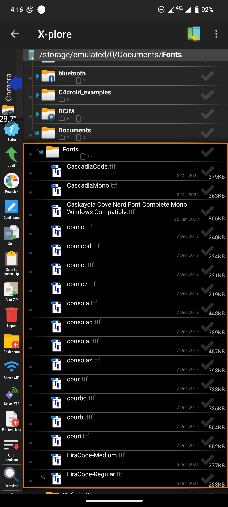
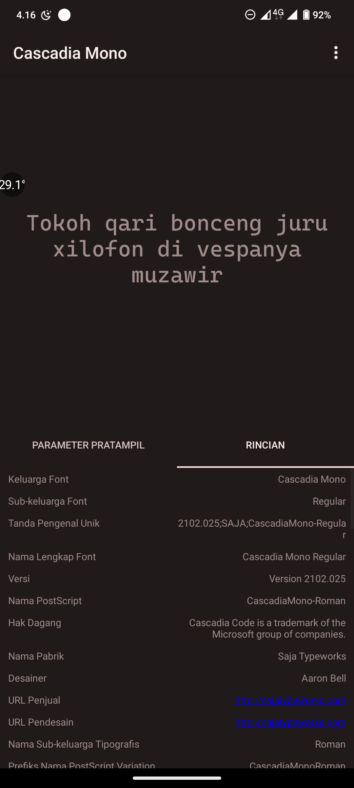
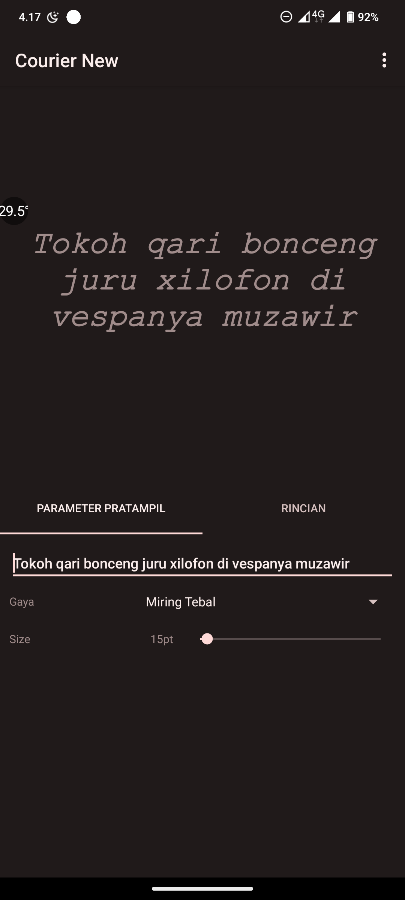
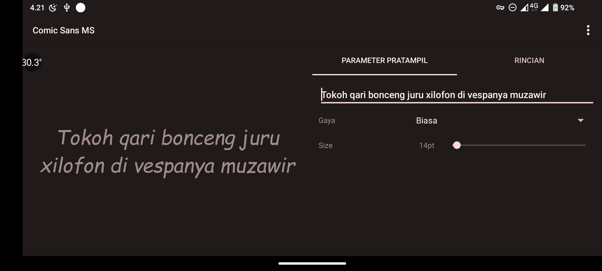
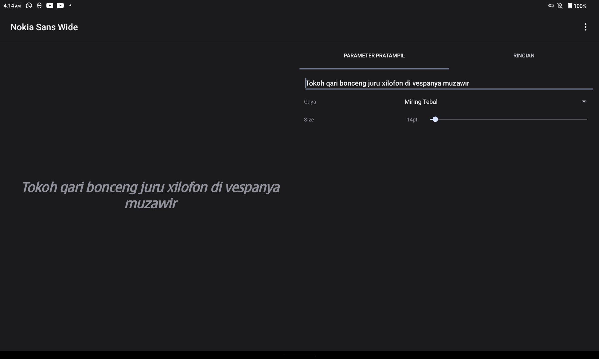

#  Font Viewer
Quick, simple, small, less-featured font viewer for Android. 
Aiming to be Android version of Windows Font Preview, except that this app cannot install font to system, that is other app's responsibility.

## Features
- Can be set as default "Open with" app
  - Also include unique file icon for file managers that supports it
- Uses Android File Chooser, No standalone file selector that requires entire filesystem permission
- No state saved, 
- Native Android UI, Looks like an app that belongs to your phone instead of those over-beautified alien UI
- No internet necessary and no user data is collected by the app itself
   - Links shown in this apps opens in browser, which needs internet and those sites might requires some of your data.
- Small, release version is less than megabytes of storage
   - We uses small amount of dependency and APIs that already available in Android itself, not even AndroidX and Jetpack were much used.
- Supports from Android 4.4 up to Android 13

## Screenshots

## Known Issues
- Some fonts like `Fira Code` seems to not being supported by Typecast due to having non-compliant `glyf` table

## Supported type
Any font is supported by Android Typeface class and Typecast library

## Dependencies
- [Typecast](https://github.com/dcsch/typecast) - for Font Info reading

## System Requirements
- Android 4.4 Kitkat
- 2MB of storage for installation

## Building
Open the project in Android Studio and build

## License
MIT License